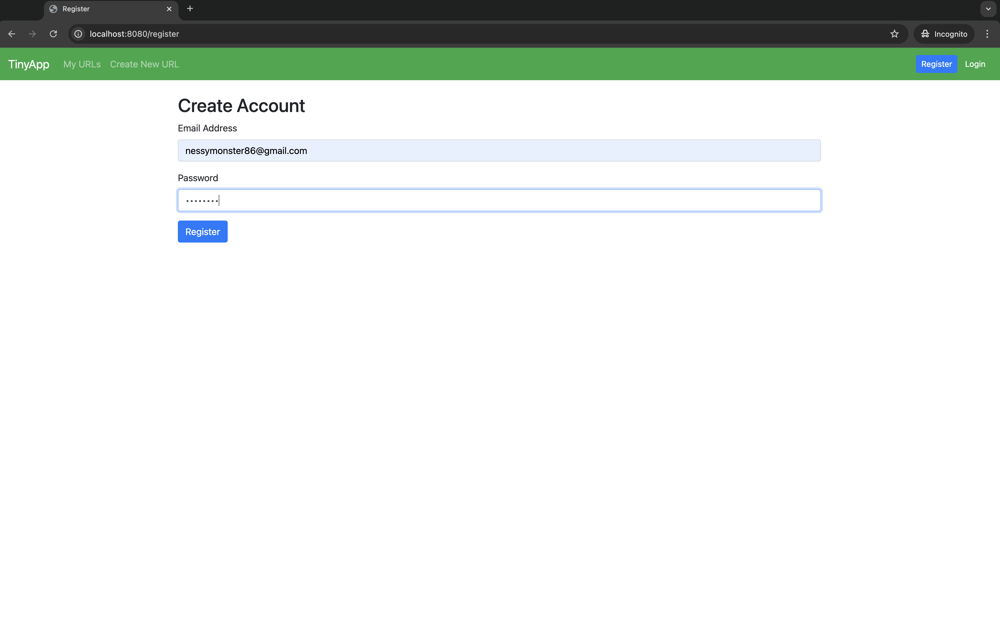

# TinyApp Project

TinyApp is a full stack web application built with Node and Express that allows users to shorten long URLs (à la bit.ly).

## Final Product
#### Homepage

The first page users will see and where they will be redirected to when logged out.

#### Register

Where the new user can go to register using and email and password which is kept secure.

#### Empty URL Main Page

The initial page new users land on after registering. Here, they can choose to navigate to the "Create New URL" page.

#### Create New URL

Here, the user can start submitting the URL's they desire to shorten. 

#### Edit URL

On this page, users are able to edit their previosuly created and stored long URL's.

#### My URLS

Users are able to see all of their shortened URL's and have the option to edit or delete, if need be.

## Dependencies

- Node.js
- Express
- EJS
- bcryptjs
- cookie-session

## Getting Started

- Install all dependencies (using the `npm install` command).
- Run the development web server using the `node express_server.js` command.
